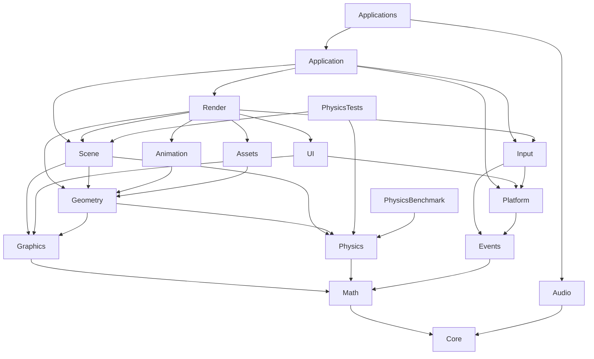

# Build System Migration architecture and roadmap

Status: bootstrap proposal awaiting human review. No phase is started or approved.
Source baseline: `render-refactor-phase-00-approved`,
`b3b043b15ee814133e8419466a1bf3a985a3c958` on `build/cmake-conan-migration`.
The [audit](BUILD_SYSTEM_AUDIT.md) and its generated-project/binary evidence support
this proposal. New source evidence may require a separately reviewed preparation
phase; never silently broaden an active contract.

## P1. Architecture decisions

Use 15 meaningful compiled modules, normally STATIC, with `GEngine::` aliases.
Keep source files in place unless a small boundary cleanup needs a new file.
Prefer `GEngine/modules/<Name>/CMakeLists.txt` as ownership definitions because
existing directories mix responsibilities; the module definition lists exact
source paths under src AND include. Do not pretend the existing Core or Assets
folder is a clean architectural boundary. No giant compatibility engine archive.
If temporarily useful, an explicitly opt-in INTERFACE convenience target may name
existing modules, but final consumers must name required roots, not all modules.

| Proposed module | Initial source ownership hypothesis | Required lower-level closure / boundary |
| --- | --- | --- |
| Core | Log, UUID, utility/base/assert/time/system/container/thread primitives | spdlog/fmt, GLM header types, standard/toolchain; no engine Math back-edge |
| Math | Math.cpp/Math/Matrix, neutral bounds extracted from Physics/Bounds | Core only where used, GLM; retain exact numerical behavior |
| Events | Events source/header family, signals/property and neutral key/controller code declarations | Core/Math as actual signatures require; SDL dispatch stays above it |
| Physics | PhysicsWorld/Body/System, collision/shapes/constraints/profiling except neutral Bounds | Core/Math; remove unused scene-component includes first |
| Graphics | Mesh buffers, GPU Geometry base, Texture/Shader/RenderTarget/FrameBuffer, Font/TextTexture, GPU/font AssetsManager and ShaderManager caches | Core/Math, GLAD, SDL2/SDL_ttf, stb; no Render/Scene/UI/Application |
| Geometry | Procedural Shapes, Curve/Surface, Terrain/Box, spatial partition data | Core/Math/Graphics and Physics for Diamond/Convex public helpers; model/animation registration stays in Render |
| Assets | Core/Image and RawModel image/model import | Core/Math/Geometry/Graphics as real return types require; stb and Assimp |
| Animation | Animation/AnimatedModel/AnimationSystem/Bone data and importer | Math/Core/Geometry, Assimp; no direct Scene dependency found |
| Scene | ECS _Scene/_Entity, neutral component methods, _Camera/SceneCamera data, existing scene-physics scheduler | Core/Math/Events/Physics/Geometry/Graphics where current mesh/shader grouping genuinely requires them; no Render/UI/Audio |
| Platform | Window/SDLWindow, WindowManager, SDL context/window services | Core/Events, SDL2/GLAD; UI hooks inverted; no Application/Input back-edge |
| Input | InputManager and SDL input adaptation | Core/Math/Events/Platform, SDL2; receive services rather than locating BaseApp |
| Audio | AudioSystem and SoundEvent | Core, FMOD::Studio/Core; no Render/Scene |
| UI | UICore and ImGuiWindow integration | Core/Graphics/Platform, ImGui/ImGuizmo; no Render |
| Render | Renderer/2D/SimpleRenderer/RenderSystem, materials, legacy Actor/Entity/Core Scene families, camera controllers, lights/sprites/character/extras, ShapeManager/Factory | Core/Math/Graphics/Geometry/Assets/Animation/Scene/Input/UI; TBB/GLAD where used; no Application |
| Application | BaseApp/GEngine composition, EntryPoint contract, EventManager routing | Platform/Input/Events/Scene/Render; apps opt into Audio themselves |

These are file-ownership hypotheses, not completed extraction claims. Phase 02
freezes an exhaustive source/header/compiled-vendor ledger before extraction.
Every existing TU must have exactly one owner; deleted duplicate compilation and
new bridge TUs must be explained. Header-only utilities belong to their meaningful
module, not dozens of one-header targets. An extraction blocks on residual cycles
or missing ownership instead of adding broad PUBLIC links.



The diagram omits redundant foundational edges and external packages. Edge
visibility follows evidence: e.g. GLM/spdlog types in public headers need propagated
requirements; private TBB use does not expose TBB headers to every consumer.
Static-library implementation link dependencies still have to reach the final
link; PRIVATE is not permission to omit them. Shader/texture GPU APIs share one
Graphics owner to avoid an artificial Assets/Render cycle. Scene retains genuine
physics scheduling and geometry links; moving solver logic for aesthetics is out
of scope. PhysicsTests has real Scene integration cases, so it cannot be labelled
kernel-only merely by its name. Legacy rendering scene classes stay in Render,
avoiding vtable references across a Scene/Render cycle.

## P2. Modern CMake policy

Use `add_library`, `add_executable`, `target_sources`,
`target_include_directories`, `target_compile_features`,
`target_compile_definitions`, `target_compile_options`, and
`target_link_libraries`. No global include/link directories or add_definitions.
Use ALIAS namespaced targets internally and imported package/SDK targets externally.
PUBLIC requirements describe exposed headers/types; PRIVATE implementation; INTERFACE
consumer-only policy/header targets. Declare C and CXX languages, retain GLAD C,
and require C++20 without `c++latest`/C++23 drift. PCH optimization is PRIVATE and
cannot supply required public includes.

Proposed minimum CMake 3.25; pin one tested patch release in Phase 01/03 rather than
implicitly using the newest installed version. Primary Windows generator is
Visual Studio 17 2022, x64, v143; configure only Debug and Release. Multi-config
build/test/run commands must always select the configuration explicitly. Establish
CMP0091 NEW before language enablement and explicit target CRT selection for both
C and C++ targets: Debug MultiThreadedDebug, Release MultiThreaded. Validate real
MSVC commands in addition to those properties. The [CMake runtime property](https://cmake.org/cmake/help/latest/prop_tgt/MSVC_RUNTIME_LIBRARY.html)
defines this mapping and the required policy timing.

Keep outputs in an isolated CMake tree (`out/build/<profile>/<config>` and
`out/run/<config>/<app>` are proposed) while preserving target artifact names.
Paths become exact in Phase 03; no clean operation may touch tracked Premake bin
or assets. Source and build-tree paths containing spaces must work.

## P3. Dependency ownership and Conan workflow

Conan **major 2** is mandatory. Pin an exact client version compatible with selected
recipes/toolchain in Phase 01; installed 2.2.3 is evidence, not an approved pin.
Use checked-in build/host profiles, including explicit Debug and Release host
profiles. Host settings: os=Windows, arch=x86_64, compiler=msvc,
compiler.cppstd=20, compiler.runtime=static, build_type and compiler.runtime_type
both matching Debug or Release. Choose compiler.version/update from the actual
VS2022 compiler (14.44 may require newer Conan settings than installed 2.2.3).
Build profile describes build tools and is distinct from the host target. Do not
use `profile detect` or global user defaults as the reproducibility contract.
The [Conan settings reference](https://docs.conan.io/2/reference/config_files/settings.html)
defines the separate MSVC runtime and runtime_type settings.

Foundation package candidates: GLM, spdlog/fmt and EnTT; then SDL2/SDL_ttf with
required FreeType/zlib closure; then Assimp and oneTBB in separate dependency checkpoints. Exact versions must match
reviewed source/ABI behavior, especially GLM 0.9.9.9 and unknown Assimp provenance.
If a matching upstream recipe is unavailable, stop for a small reviewed local
recipe/provenance preparation contract. Never silently upgrade, fetch from another
system root, or fall back to FetchContent. Existing custom tests need no framework
dependency. Do not add unused rttr/reflection/eventpp packages.

Vendored STATIC targets: GLAD C; ImGui core/required backends; ImGuizmo active copy;
stb implementations. Verify vendor PCH edits before isolating them. Preserve vendor
versions and compile ownership, including GLM instantiations until proven redundant.
Choose a single fmt mode/owner to avoid bundled/external symbol or macro mismatches.

FMOD stays outside Conan: explicit `FMOD_SDK_ROOT` supplied locally, verified
headers/import libraries/DLLs/version/architecture and configuration pairs.
Use imported `FMOD::Core` and `FMOD::Studio` with per-config IMPORTED_IMPLIB and
IMPORTED_LOCATION and Studio-to-Core link requirements. Do not use bin as the SDK
source or publish proprietary SDK contents. Existing checked-in FMOD is reference
evidence; a verified SDK copy can be supplied from those bytes only with recorded
origin/hashes and distribution permissions, not undocumented path discovery.

Use [CMakeToolchain](https://docs.conan.io/2/reference/tools/cmake/cmaketoolchain.html)
for Conan's generated toolchain/presets and
[CMakeDeps](https://docs.conan.io/2/reference/tools/cmake/cmakedeps.html) for package
config targets consumed by find_package. Generated files stay in the build tree.
Track recipe references/revisions, options, locked dependency graphs and package
IDs/binary revisions for Debug/Release; hash profiles and tool versions. Ordinary
installs consume locks and approved remotes without update. Building missing
packages is an explicit reproducible source-build policy, never an uncontrolled
fallback; record its compiler/options and resulting package revision.

Reproducible sequence, to be implemented in later phases: verify pinned tools/SDK;
install Conan with explicit host/build profiles and lock into each configured
output root; configure CMake with the generated toolchain and pinned VS2022
generator/architecture/toolset; build the selected target/config; stage and verify
runtime/resources; run CTest or the selected app with explicit CWD. CMake must also
be usable directly with that same generated input. Bootstrap implements none of it.

## P4. Equivalence and baseline defects

Maintain an immutable Phase 00 reference record and the current Premake path while
adding CMake incrementally. Both paths may use separately supplied dependencies,
but semantic version/ABI differences need evidence and human approval. Boundary
phases must continue to build the Premake reference and preserve behavior.

| Dimension | Required comparison |
| --- | --- |
| Language/CRT | Every relevant actual cl command: /std:c++20, x64, /MTd Debug, /MT Release; C stays C |
| Definitions/options | Compare evaluated per-target/per-config flags, profiling mode, exception/RTTI/optimization/PCH differences and rationale |
| Ownership/dependencies | Complete source ledger, one TU owner, explicit static link closure, no hidden cycles or missing vendor implementation |
| Outputs | Correct executable/library names/config separation, no stale artifacts; deliberate CMake root changes documented |
| Runtime/resources | Correct dependency origins/config/architecture/closure; empty staging tests; expected CWD/assets; no PATH/bin dependency |
| Applications | All four apps in both configurations: startup, appropriate input/render/UI/audio flows, resource load and shutdown |
| Tests | Current full PhysicsTests outcome plus focused integration checks; retained diagnostics classified explicitly |
| Benchmark | Same inputs/CSV semantics/deterministic results and profiling compile-out/on behavior; timings descriptive, no invented speed target |
| Warnings | Zero first-party compiler and linker warnings; vendor diagnostics counted separately |

Phase 00 establishes fresh results; bootstrap has not measured them. Rendering/
Physics defects remain baseline-known only with source-tag reproduction/evidence.
No new failure is grandfathered by a historical review. The lattice-bounce diagnostic
is context, not a Build task. Missing SDKs/driver/recipe/ABI information block their
dependent phases. A required warning/CRT gate cannot be waived silently.

## P5. Runtime/resources and Python orchestration

Preserve current postbuild verification until CMake staging is independently
validated. Replace binary-name existence checks with explicit producer provenance,
configuration, hashes, normal/delay/runtime-loaded closure, and non-system DLL
inventory. Package runtime files come from the resolved Conan dependency graph;
FMOD from verified SDK targets; assets from tracked source manifests. Use system
DLL exclusions based on the actual Windows/SDK contract. Test with an empty output
and restricted documented PATH, not with a developer's previous bin contents.

Preserve relative resource behavior by staging the required directory hierarchy
and declaring CWD per application. Do not redesign resource APIs in this track
unless a demonstrated blocker gets a separate preparation contract. Keep missing-
resource/DLL errors actionable and preserve robocopy failure semantics until retired.

The planned thin driver offers:

```text
python scripts/gengine.py setup --config Debug|Release
python scripts/gengine.py build --target NAME --config Debug|Release
python scripts/gengine.py run --target NAME --config Debug|Release
python scripts/gengine.py build-run --target NAME --config Debug|Release
python scripts/gengine.py test --target NAME --config Debug|Release
python scripts/gengine.py clean --target NAME --config Debug|Release
```

Python handles argument validation, tool discovery/version checks, subprocess exit
codes and invoking Conan/CMake/CTest. CMake exposes target/run/resource metadata
through generated manifests or file API; Python must not duplicate dependency
edges, DLL inventories or resource lists. `run` never silently builds; build-run
stops if build/staging fails. Test selectors map to existing CTest metadata; clean
validates resolved owned output roots and leaves tracked inputs/Premake bin intact.

## P6. Phase sequencing and gates

The 45 contracts below are a single serial approval chain. Every phase XX > 00
requires **XX-1 approved, committed, annotated-tagged and pushed**, and starts at
that exact checkpoint; Phase 00 requires the source tag and human START. Semantic
prerequisites in the table add technical explanation; they do not allow skipping
the immediate predecessor. Boundary/preparation phases are explicitly labelled.
Every contract is a scope/review/checkpoint/rollback unit. All are generated now.

Mandatory validation is scaled to the phase: documentary preparation checks its
evidence, build changes validate affected Debug/Release targets and actual commands,
boundary changes compare Premake outcomes, runtime/app changes test fresh staging,
and final equivalence covers the full matrix. No phase can use a previous phase's
approval as permission to start. APPROVE itself does not rerun costly validation
unless the human uses WITH REVALIDATION. See root governance for sealed checkpoints.

All changes end in one review and a Final Validation Snapshot. If a boundary is
already proven clean at execution time, record new tracked evidence supporting
that decision instead of manufacturing a source refactor. An approval still needs
a real new reviewed Git checkpoint, never an empty commit.

| Phase / complete contract | Title | Kind | Immediate predecessor | Technical prerequisites |
| --- | --- | --- | --- | --- |
| [00](phases/BUILD_PHASE_00.md) | Capture the current Premake reference | REFERENCE PREPARATION | source tag | Source tag and bootstrap review |
| [01](phases/BUILD_PHASE_01.md) | Resolve dependency provenance and pin decisions | DEPENDENCY PREPARATION | 00 | 00 |
| [02](phases/BUILD_PHASE_02.md) | Freeze source ownership and comparison tooling | OWNERSHIP PREPARATION | 01 | 00, 01 |
| [03](phases/BUILD_PHASE_03.md) | Introduce the CMake foundation and MSVC policies | BUILD FOUNDATION | 02 | 01, 02 |
| [04](phases/BUILD_PHASE_04.md) | Add Conan profiles and foundation packages | DEPENDENCY INTEGRATION | 03 | 01, 03 |
| [05](phases/BUILD_PHASE_05.md) | Isolate the vendored implementation targets | VENDOR / PCH BOUNDARY PREPARATION | 04 | 02, 03, 04 |
| [06](phases/BUILD_PHASE_06.md) | Integrate SDL2 and text-rendering packages | DEPENDENCY INTEGRATION | 05 | 01, 04, 05 |
| [07](phases/BUILD_PHASE_07.md) | Integrate the Assimp package | DEPENDENCY INTEGRATION | 06 | 01, 04 |
| [08](phases/BUILD_PHASE_08.md) | Integrate the oneTBB package | DEPENDENCY INTEGRATION | 07 | 01, 04 |
| [09](phases/BUILD_PHASE_09.md) | Model the local FMOD SDK with imported targets | SDK INTEGRATION | 08 | 01, 03 |
| [10](phases/BUILD_PHASE_10.md) | Extract the Core foundation target | MODULE EXTRACTION | 09 | 02, 04, 05 |
| [11](phases/BUILD_PHASE_11.md) | Extract Math and neutral bounds | MODULE EXTRACTION / VALUE BOUNDARY PREPARATION | 10 | 10 |
| [12](phases/BUILD_PHASE_12.md) | Extract Events and shared input value declarations | MODULE EXTRACTION | 11 | 10, 11 |
| [13](phases/BUILD_PHASE_13.md) | Remove Physics header and PCH dependence on scene components | CYCLE / BOUNDARY PREPARATION | 12 | 11, 12 |
| [14](phases/BUILD_PHASE_14.md) | Extract the Physics kernel target | MODULE EXTRACTION | 13 | 13 |
| [15](phases/BUILD_PHASE_15.md) | Prepare the Graphics and Assets ownership boundary | CYCLE / BOUNDARY PREPARATION | 14 | 06, 11, 14 |
| [16](phases/BUILD_PHASE_16.md) | Extract the Graphics target | MODULE EXTRACTION | 15 | 15 |
| [17](phases/BUILD_PHASE_17.md) | Extract procedural Geometry | MODULE EXTRACTION | 16 | 16 |
| [18](phases/BUILD_PHASE_18.md) | Extract image and model Assets | MODULE EXTRACTION | 17 | 07, 17 |
| [19](phases/BUILD_PHASE_19.md) | Extract Animation and its import boundary | MODULE EXTRACTION / BOUNDARY CHECK | 18 | 07, 17, 18 |
| [20](phases/BUILD_PHASE_20.md) | Prepare the one-way Scene to Physics integration | CYCLE / BOUNDARY PREPARATION | 19 | 14, 17, 19 |
| [21](phases/BUILD_PHASE_21.md) | Separate ECS components from Render statistics and helpers | CYCLE / BOUNDARY PREPARATION | 20 | 20 |
| [22](phases/BUILD_PHASE_22.md) | Extract the ECS Scene target | MODULE EXTRACTION | 21 | 21 |
| [23](phases/BUILD_PHASE_23.md) | Remove Input and event dispatch dependence on BaseApp | CYCLE / BOUNDARY PREPARATION | 22 | 12, 22 |
| [24](phases/BUILD_PHASE_24.md) | Invert the Platform and UI lifecycle boundary | CYCLE / BOUNDARY PREPARATION | 23 | 15, 23 |
| [25](phases/BUILD_PHASE_25.md) | Extract Platform window and context services | MODULE EXTRACTION | 24 | 24 |
| [26](phases/BUILD_PHASE_26.md) | Extract Input services | MODULE EXTRACTION | 25 | 25 |
| [27](phases/BUILD_PHASE_27.md) | Extract Audio with FMOD ownership | MODULE EXTRACTION | 26 | 09, 10 |
| [28](phases/BUILD_PHASE_28.md) | Extract UI and its backend integration | MODULE EXTRACTION | 27 | 05, 16, 25 |
| [29](phases/BUILD_PHASE_29.md) | Remove Render dependence on Application services | CYCLE / BOUNDARY PREPARATION | 28 | 22, 26, 28 |
| [30](phases/BUILD_PHASE_30.md) | Extract the Render target | MODULE EXTRACTION | 29 | 08, 29 |
| [31](phases/BUILD_PHASE_31.md) | Extract Application composition | MODULE EXTRACTION | 30 | 30 |
| [32](phases/BUILD_PHASE_32.md) | Migrate the PhysicsBenchmark target closure | CONSUMER MIGRATION | 31 | 14, 31 |
| [33](phases/BUILD_PHASE_33.md) | Migrate PhysicsTests while preserving scene coverage | CONSUMER MIGRATION | 32 | 22, 32 |
| [34](phases/BUILD_PHASE_34.md) | Add verified runtime DLL staging | RUNTIME SAFEGUARD | 33 | 06, 07, 08, 09, 31, 33 |
| [35](phases/BUILD_PHASE_35.md) | Stage resources and declare application working directories | RESOURCE / CWD SAFEGUARD | 34 | 34 |
| [36](phases/BUILD_PHASE_36.md) | Migrate GEngineEditor | APPLICATION MIGRATION | 35 | 31, 35 |
| [37](phases/BUILD_PHASE_37.md) | Migrate RigidBodySimulation | APPLICATION MIGRATION | 36 | 36 |
| [38](phases/BUILD_PHASE_38.md) | Migrate Breakout | APPLICATION MIGRATION | 37 | 37 |
| [39](phases/BUILD_PHASE_39.md) | Migrate RayTracing | APPLICATION MIGRATION | 38 | 08, 38 |
| [40](phases/BUILD_PHASE_40.md) | Add Python setup and build orchestration | DRIVER INTEGRATION | 39 | 39 |
| [41](phases/BUILD_PHASE_41.md) | Complete Python run, build-run, test and safe clean | DRIVER INTEGRATION | 40 | 40 |
| [42](phases/BUILD_PHASE_42.md) | Demonstrate full Premake and CMake equivalence | FULL EQUIVALENCE GATE | 41 | 41 |
| [43](phases/BUILD_PHASE_43.md) | Make CMake and Conan the authoritative build | AUTHORITATIVE SWITCH | 42 | 42 |
| [44](phases/BUILD_PHASE_44.md) | Retire Premake after the authoritative switch | PREMAKE RETIREMENT | 43 | 43 |
