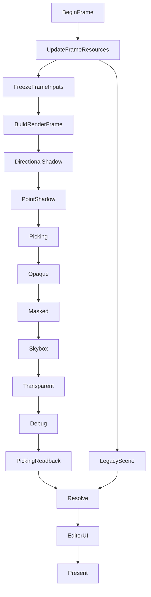

# GEngine rendering architecture

Updated for the Rendering Phase 68 candidate based on approved Phase 67,
commit `108a0eed77d945bf68e3b9061e562aa8341ea55f`. This describes current source;
phase approval is established by its checkpoint, not this guide. Paths below
are relative to the repository root. Public header shorthand is relative to
`GEngine/include/GEngine/`.

## Build and runtime

The maintained implementation is Windows x64, Premake/VS2022, v143/MSVC tools
14.44.35207, Windows SDK 10.0.26100.0, static Debug/Release CRT and the existing
bundled dependencies. `premake5.lua` selects C++23 for eight C++ targets through
`stdcpp23` (`/std:c++23preview`), preserving the separate glad C target. The four
graphical applications are GEngineEditor, Breakout, RayTracing and
RigidBodySimulation; PhysicsTests, PhysicsBenchmark and RenderingValidation are
separate executables. No CMake/CTest or alternate graphics backend is implied.

From a VS2022 developer PowerShell with the recorded toolset installed:

```powershell
.\vendor\bin\premake\premake5.exe vs2022
MSBuild.exe .\RigidBodySimulation\RigidBodySimulation.vcxproj /t:Build /m:1 /nr:false /p:Configuration=Debug /p:Platform=x64 /p:VCToolsVersion=14.44.35207 /p:WindowsTargetPlatformVersion=10.0.26100.0
```

Use `Configuration=Release` for Release. The project builds its dependencies and
runs its existing postbuild staging. Run the application from its staged directory,
for example `bin/Debug/RigidBodySimulation/`. Do not replace the bundled runtime
DLLs to work around a failed build. `GEngine/src/Core/RuntimeAssets.cpp` resolves
assets relative to the executable, checks an application startup manifest, and
accepts an explicit absolute `GENGINE_ASSET_ROOT` override. Application
`postbuild.py` scripts use `tools/postbuild.py`; staged assets and DLLs
are required.

## Language, errors and generic APIs

C++23 was activated at Phase 26; pre-26 C++20 validation records are historical.
Recoverable migrated operations return `std::expected<T, TypedError>` or
`std::expected<void, TypedError>` and propagate `std::unexpected` with the domain,
operation and original diagnostic payload. `ApplicationInitializationResult`,
`ApplicationRunResult` and `ScheduleError` preserve failures through the root,
application and scheduler. `BaseApp::FailRuntime` records the first callback
failure; `Run` stops before subsequent rendering and EntryPoint reports it through
the engine logger. Partial initialization uses scoped ownership and rollback.

New/migrated production boundaries use no explicit `throw`, `try`, `catch`, custom
recoverable exception API or `std::exception_ptr` task transport. Invariants use
assertions/debug-fatal policy; a failed load, unsupported capability or bad user
descriptor needs a typed error. Destructors do not throw; `noexcept` moves must
actually uphold that contract. This is a source policy, not a compiler-wide
no-exceptions switch or a promise that all standard/dependency allocations cannot
throw. Prefer their non-throwing APIs; do not add catch-and-rethrow adapters.

Use `std::print`/`std::println` for tools, tests and appropriate bootstrap console
output. Runtime subsystem messages stay in `Core/Log.h` so severity, category,
sinks and filtering remain centralized. Prefer meaningful C++20 concepts and
`requires`, using standard concepts when accurate. Current examples are
`InterleavedVertexRecord` in `Mesh/MeshAsset.h`, `RenderDataComponent` in
`Component/RenderComponents.h`, and `std::constructible_from` constraints in
`Assets/AssetRegistry.h`. Avoid new `enable_if`/SFINAE where a concept suffices;
keep `static_assert` for layout, ABI, representation and invariants. Do not add
templates solely to modernize syntax.

Phase 68's owner-authorized cleanup removes the 17 explicit exception tokens,
three stream exception masks and eight `RuntimeAssets::Directory` declarations
retained at the Phase 67 checkpoint. The exact owned-production audit now has
zero explicit exception syntax, exception transport or custom exception classes.
The attributed Barak Shoshany implementation at `Core/ThreadPool.h` remains a
third-party boundary; dependency sources remain excluded.

`RuntimeAssets::Initialize` validates a candidate package before publishing its
root and returns a typed `PlatformResult`. `TryFile` checks required resources;
`ResolvePath` validates a package-relative name while preserving an optional
consumer's explicit logged fallback. Terrain and audio startup now return typed
failures and retire partial owners. Materials resolve default package-relative
shader names inside their existing fallible factory. EntryPoint checks startup,
initialization and runtime results and returns a nonzero exit for failure.

`Core/RenderBaseline.h` exposes only semantic errors and a move-only session.
SDL/OpenGL collection lives in `GEngine/src/Core/RenderBaseline.cpp`. The window
swap callback retains the first capture failure; BaseApp returns it through the
existing runtime error channel. The Phase 13 protocol, counters, 1280x720 size,
VSYNC=0, 120 warmup frames and 240 samples are unchanged. File output uses explicit
stream-state checks, and failed captures restore readback state before returning.

The active Phase 68 owner amendment permits only RigidBodySimulation as an
executable acceptance workload, minimum affected header/object compilation and
GEngine/RBS Debug/Release builds. Other applications, standalone runtime probes,
full-solution rebuilds and historical performance/comparison workflows are not
run. Existing Phase 65 performance findings and thresholds remain unchanged;
functional collector checks do not constitute new performance acceptance.

## Normal contracts and backend implementation

Applications, scene/ECS, assets and cross-module rendering consumers use semantic
descriptors, typed handles, views and errors. Examples are `Core/Platform.h`,
`Core/Window.h`, `Core/FrameBuffer.h`, `Mesh/GpuMesh.h`, `Material/Pipeline.h`,
`Renderer/FrameScheduler.h` and `UI/FramebufferImage.h`. Native names are neither
asset identities nor public texture/program/buffer getters. Forward declarations,
aliases and transitive includes also count when inspecting a public dependency
boundary.

The implementation uses OpenGL 4.6/GLAD and SDL windows/contexts. Native access is
confined to implementation dependencies such as `GEngine/src/Assets/ShaderBackend.h`,
`GEngine/src/Assets/TextureBackend.h`, `GEngine/src/Core/FramebufferBackend.h`,
`GEngine/src/Scene/SceneBackend.h`, `GEngine/src/Renderer/GLStateCache.h` and
`GEngine/src/Renderer/GLPassState.h`. SDLWindow/ImGuiWindow implementation headers
are under `GEngine/include/GEngine/Windows/` but are backend-private dependencies;
directory placement alone does not make an API suitable for normal consumers.
`Core/GLContextThread.h` is also backend-only, including its retained SDL context
interop shim; normal platform startup uses its typed result internally. There is
no public RenderDevice class or second backend to integrate.

Assimp conversion stays in mesh/model/animation implementation. ImGui's GL/SDL
backends and image identifier conversion stay in window/UI implementation.
Existing application UI authoring still calls ImGui, and `UI/UICore.h` exposes
ImGui widget types: this is the retained ImGui UI dependency, not a backend-neutral
widget toolkit. Use `UI::FramebufferImage` or `UI::RasterImage` for rendering image
presentation. This documentation does not authorize an additional native interop
surface or certify every UI header as native-free.

## Application loop and presentation time

`GEngine/src/Core/BaseApp.cpp` owns event pumping, input transitions, pacing,
Update and Render. `Core/FrameClock.h` uses `steady_clock`: raw elapsed seconds
include pacing and stalls; render/input time clamps to 0.25 seconds. Update receives
raw time (the opt-in frozen benchmark deliberately supplies zero). Active VSYNC
owns pacing; otherwise the configured manual cap sleeps to the next measured frame
start. Suspended rendering still processes restore/close events, sleeps 16 ms,
resets the clock and skips simulation/render work.

The modern ECS `_Scene` is the single fixed-step scheduler: 1/60 s, at most two
steps per Update, up to 0.25 s retained backlog with discarded-time accounting.
Interpolation alpha clamps to [0,1]; a retained whole tick displays the current
pose rather than extrapolating. Presentation interpolates previous/current poses;
it never writes interpolated transforms back to authoritative PhysicsBody state.
Hierarchy, bounds and revision caches derive from the presentation pose. Explicit
teleports and relevant creation/parenting operations reset interpolation history.
Source: `GEngine/include/GEngine/Scene/_Scene.h`, `GEngine/src/Scene/_Scene.cpp`
and `GEngine/src/Scene/RenderState.cpp`.

## Ownership, shutdown and the GL thread

`EngineContext` is declared in `Core/GEngine.h`, not a separate EngineContext
header. BaseApp owns the root. Only one live root is supported; it owns the
platform/windows, assets, shaders, shapes and asset publication domain. Manager
access returns typed readiness/thread/context failures. Initialization commits
only after all required services are ready and rolls back on failure.

Application scenes, cached resource leases, frames, submission owners and targets
must retire before their registries and context. Stop external asset producers,
close/cancel/join loaders, then retire frames/registries and GPU owners before
platform teardown. BaseApp releases its scene, UBO and framebuffer/target owners
while the context is current; EngineContext releases managers, requires the
publication domain drained, then releases the platform. Context activation failure
during destruction is fatal because safe GPU cleanup is no longer possible.

All GL creation, upload, readback, draw, ImGui backend rendering and destruction
run on the owning current context thread. `Core/GLContextThread.h` enforces the
registered context/thread relation. GPU owners are move-only and retire exactly
once. Workers may decode/import/build CPU data; they never issue GL or retire a
GPU owner. A worker-safe status query is not permission to mutate a registry.

## Asset identity, publication and resource versions

`Assets/AssetHandle.h` supplies one typed model: a 32-bit slot, 64-bit generation
and 64-bit registry domain. Default handles are invalid; exhausted identities do
not wrap into live old handles. `EntityRenderId` and upload tickets use this model
with distinct tags. Handles are process-local, not disk IDs or native names.

`AssetPublication::BeginPublication` gates create/replace/destroy. `BeginFrame`
and its read pins exclude publication while preparation, extraction and CPU
submission consume one resolved version set. `AssetRegistry` leases pin exact
resource revisions; retired versions remain owned until CPU references and
registered GPU retirement fences permit collection. Retain the registry and
publication domain through that retirement. Do not resolve a handle anew mid-pass.

## Mesh, texture, sampler and material

`MeshAsset` owns CPU interleaved vertex records, explicit indices, submesh/material
ranges and bounds. `MeshImporter` normalizes CPU data with typed errors; Assimp
types do not enter its public contract. `GpuMesh` owns backend storage and exposes
semantic layout/update/draw operations; dynamic updates preserve capacity/layout.
The retained Geometry import path still supports Editor and private physics shape
attachment; it is not the modern mesh API.

`TextureResource` and `TextureDesc` describe image storage, usage, format, color
space and mip intent. A `SamplerDesc` describes sampling separately. The sampler
cache shares equivalent descriptors; material bindings use deterministic semantic
ordinals. Do not rely on a legacy texture's mutable bind state as material identity.

`PipelineState` defines semantic depth/cull/blend/alpha state. `MaterialTemplate`
defines immutable parameters and texture slots in sorted declaration order;
`MaterialInstance` authors values and resource handles. Preparation validates and
retains immutable packets containing exact resolved resource versions. CPU
parameter packing is not the OpenGL buffer ABI;
`GEngine/src/Renderer/SubmissionGpuLayout.h` owns that translation.

## Scene, extraction, RenderFrame and visibility

`Component/RenderComponents.h` contains render data and handles, not draw methods
or GPU ownership. A MeshRendererComponent selects one submesh/material pair.
Visibility, camera and light components carry intent. `Scene/RenderEcs.h` guards
identity, mutation and serial extraction; `_Scene` supplies typed entity/hierarchy
operations and presentation/bounds revisions.

`ExtractRenderFrame` prepares lazy presentation caches and resource versions on the
owner, freezes ECS reads, then emits deterministic hierarchy-ordered draw/light
records. A stale enabled resource, invalid submesh or capacity error rejects the
complete frame. Positive light contribution uses finite typed values; no silent
light truncation occurs. Caller camera order is preserved.

`RenderFrameBuilder` finalizes once. The resulting `RenderFrame` is immutable,
exposes const spans and retains prepared resource packets without copying heavy
assets. `RenderVisibility` creates lists of frame-local draw ordinals. It applies
camera layers and conservative frustum/AABB tests; invalid/degenerate bounds are
kept conservatively. Shadows are selected independently of camera-frustum/layer
filtering, then culled for each light/cascade/face. Neither culling nor sorting
mutates the frame or consults live ECS/registries.

`RenderTaskFrame` uses bounded joinable CRT thread batches, disjoint input lanes
and scratch, typed callback results and owner-order merge. All launched work joins
on every exit; cancellation discards partial output. Serial is the measured
default (`workers=0`); optional extraction uses a 4096-entity threshold. Worker
launch fallback is explicit and occurs before any callback starts. There is no
retained extraction thread pool or detached frame work. `RenderMutationQueue`
applies CPU-owned commands at the owner publication boundary, outside frozen reads.

## Async loading and upload

`Assets/AsyncUploadQueue.h` defines Requested -> Loading -> CpuReady -> Uploading
-> Ready, with Failed and Cancelled terminal outcomes. Capacity, decoded-byte and
per-frame upload budgets are bounded; a time budget cannot preempt an in-progress
decode/import/upload. Decode jobs transfer immutable owning CPU payloads.
FrameScheduler alone drains uploads at UpdateFrameResources, before frame access
and extraction. A successful upload publishes a handle; pending/failed requests
leave the caller's explicitly selected placeholder in place and retain diagnostics.

`AsyncTextureLoader` supports 2D R8/RGB8/RGBA8 files. Cube/float/depth/attachment
paths remain synchronous. `AsyncMeshLoader` supports static mesh import, including
OBJ directive screening; it does not implement animated import, reload or eviction.
Both coalesce aliases using file identity plus descriptor/import options, share
terminal results/cancellation, and bound ticket retention for the loader lifetime.
Ready/Uploading cancellation reports Busy. Assimp allocation is outside the
engine-payload budget, and a blocking Assimp import can delay cooperative shutdown.

## Frame sequence and pass state

The names and order below follow `GEngine/src/Renderer/FrameScheduler.cpp` and
`GEngine/src/Renderer/FrameSubmission.cpp`. Conditional passes can be skipped or
reuse valid contents; this is not an editable render graph.



Modern drawing and legacyScene are mutually exclusive inputs. CPU frame leases
retire after Submit; a requested picking readback runs before UI advances input.
The scheduler then resolves color, authors/submits UI and presents windows in
window-ID order, restoring the main context. UI-only and invisible frames omit the
inapplicable scene stages. External callbacks return on their owning context with
queries/feedback finished; they do not resolve or swap independently.

Each pass establishes a semantic state contract. The private GL state cache lives
only within a known context/scope; legacy callbacks, UI, blits and context switches
invalidate assumptions. Opaque/masked locality sorting uses full pipeline,
material, mesh/submesh identities and source-order ties. Transparent draws sort
back-to-front by camera-space object origin with source-order ties; depth writes
are off and the selected straight/premultiplied blend policy is honored. Masked
coverage and alpha thresholds agree across color, picking and shadows. This object
ordering cannot solve intersecting transparent surfaces.

Frame, material and instance payloads use the private consolidated upload buffers;
they are not a persistent-mapped ring allocator. Compatible opaque/masked and
shadow/picking runs of at least four instances may batch. Transparency remains
serial; disabling instancing uses the same sorted immutable frame. Counters
distinguish logical items from actual draw calls.

## Viewports, picking and shadows

Window/platform dimensions, framebuffer storage and logical UI dimensions are
separate semantic values. `RenderTargetDesc` controls attachment usage, extent,
format and samples. Zero extents defer storage. Reconfiguration replaces storage
transactionally, retaining the old target on failure; attachment views follow the
owner's current storage, so the owner must outlive them. UI presents resolved color.

RigidBodySimulation requests picking for an eligible click in its viewport, maps
logical coordinates to framebuffer pixels, reads a signed integer pixel and
resolves it through `EntityPickTable` to a generation-safe EntityRenderId. Stale
or foreign identities do not become selections. Readback is synchronous and
on-demand, not an asynchronous PBO service.

FrameSubmission currently supports one directional, one point and one unshadowed
spot light; additional lights or spot shadows return a typed capability error.
Shadow quality defaults to High/4096. Low/1024 and Medium/2048 are explicit choices;
8192 is custom-only. Lower-tier fallback requires an explicit policy. Both shadow
targets replace as one transaction. Depth payload estimates and queried image
bytes are not physical/resident VRAM measurements.

Directional/point shadow and picking passes cache scalar input signatures and
storage identities. Resizing changes the storage identity; changed membership,
pose, resources, lights, cameras or settings invalidate relevant contents.
External writers must call `FrameSubmission::InvalidatePassContents` before reuse.
Shadow culling retains uncertain/intersecting casters conservatively and offers a
broadcast reference switch. Cache reuse never grants another submitter ownership.

## Retained frontends and ray tracing

RigidBodySimulation uses SceneRenderResources -> extraction -> RenderFrame ->
FrameSubmission. Editor retains Actor Scene drawing through BaseApp/EngineContext
and `legacyScene`; Breakout retains Renderer2D/SpriteEntity in that callback.
Residual RenderSystem remains for retained callers/fixtures. These frontends are
frozen for new clients/features, with existing applications maintained. There is
no blanket legacy deletion, Editor animation parity or new backend in this work.

RayTracing retains CPU SimpleRenderer/TBB work. Tasks join before owner-thread
Image upload; typed ImageError reaches the runtime channel and failed UI authoring
is discarded. `Image::Create` and `UI::RasterImage` replace the old application
native texture-ID handoff. The path-taking Image constructor is a retained stub,
not a supported loader. See the [legacy policy](LEGACY_RENDERER_POLICY.md) for the
owner's freeze decision; its Phase 64 inventory is explicitly historical.

## Validation, profiling and evidence limits

The [validation index](../RenderingValidation/README.md) distinguishes current
entry points from historical phase recipes. For the independent small harness:

```powershell
python tools/rendering_validation.py --configuration Debug --gl --output logs/rendering/validation/Debug
python tools/rendering_validation.py --configuration Release --gl --output logs/rendering/validation/Release
```

This harness is not a complete application acceptance suite. `--counters` adds
CPU/GL counter checks; `--asan` requires the matching MSVC sanitizer component;
`--no-build` is valid only for matching inputs/binaries. The runner discovers the
installed VS2022 default toolset: verify it matches the recorded selection before
using its build path. TSan is unavailable on the maintained MSVC/Windows path;
do not replace the toolchain to claim coverage.

Current source locators for focused suites include `tools/test_frame_submission.py`,
`tools/test_render_extraction.py`, `tools/test_async_upload.py`,
`tools/test_async_texture.py`, `tools/test_async_mesh.py` and `tools/test_viewport.py`.
Inspect each runner's `--help` and prerequisites before selecting it. Historical
recipes are not a guarantee that every old fixture still compiles against HEAD.
`tools/test_rbs_phase66.py` additionally needs the local pinned renamed-loader
object under `logs/rendering/phase66/ui-failure-retirement/`; it is not a clean
checkout smoke command. Phase 66's final acceptance was explicitly RBS-only;
earlier multi-application results retain their original input/scope identities.

`RenderCounters` reports engine-observed calls and bytes, not all driver activity
or physical GPU memory. `PassTiming` owns 64 timestamp pairs per window/context,
collects available results on later frames (minimum delay two), and distinguishes
Pending/Unsupported/PoolExhausted/NotMeasured/Abandoned from measured zero. UI and
presentation timing have explicit CPU/count coverage limits. Opt-in settings are
read by `GEngine/src/Windows/SDLWindow.cpp`.

`tools/rendering_baseline.py` and `tools/final_performance_validation.py` retain
matched-workload measurement workflows, with historical reference inputs. Compare
hardware/driver, camera, dimensions, settings, warm-up, repeated median/tail data
and non-timing work counters. Separate simulation, preparation/extraction,
submission and GPU timings. Do not infer speedups from unmatched scenes or require
cross-GPU image byte identity. Phase 67 verifies documentation references and
contracts only; it reruns no builds, runtime tests, benchmarks or captures.
